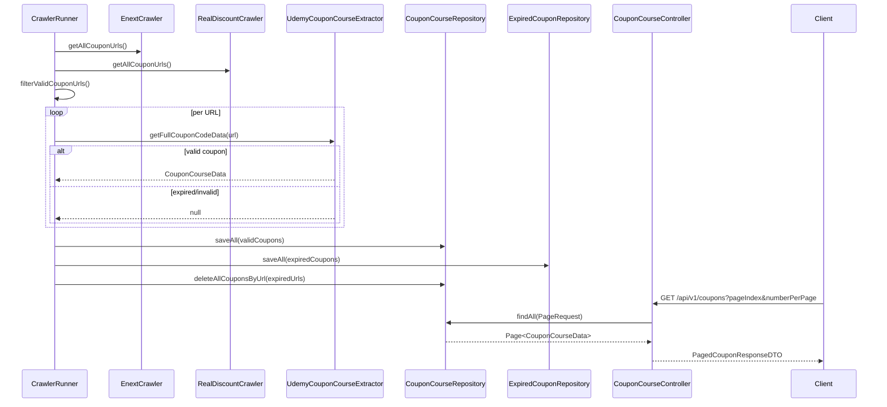

# Business Logic & Flow

## Module Map
- `coupon-domain`: DTOs, entities, repositories, shared utilities (`UdemyCouponCourseExtractor`, `LastFetchTimeManager`), and Flyway migrations (classpath `db/migration`). Both services depend on this module.
- `coupon-api-service`: REST stack (controllers, services, OpenAPI, security). Builds the Swagger-enabled HTTP API exposed on port 8080 by default.
- `coupon-crawler-service`: Dedicated Spring Boot app (port 8081) hosting `CrawlerRunner` plus crawler implementations/schedulers. Can run headless or via Actuator endpoints.

## High-Level Architecture
- **Crawler layer** (`modules/coupon-crawler-service/src/main/java/.../crawler_runner`): pulls coupon URLs from multiple sites, validates each coupon via the Udemy API, and persists valid/expired entries.
- **Service + Repository layer** (`CourseResponseService`, `CouponCourseRepository`, etc.): encapsulates pagination, filtering, search, and CRUD-like operations on coupon data.
- **API layer** (controllers under `modules/coupon-api-service/src/main/java/.../controller`): exposes REST endpoints for coupons (`/api/v1/coupons/**`) and authentication (`/api/v1/auth/**`).
- **Security/Auth** (`modules/coupon-api-service/.../security`): handles registration, login, JWT issuance, and refresh-token rotation.

## Coupon Crawling Pipeline
1. `CrawlerRunner` implements `ApplicationRunner`, so `startCrawler()` fires after the Spring context starts.
2. Fetch round:
   - Collect URLs from `EnextCrawler` and `RealDiscountCrawler`.
   - Merge with existing coupon URLs, filter out duplicates/expired ones (`filterValidCouponUrls`).
3. Validation round:
   - Fan out work across a fixed thread pool (size `custom.number-of-request-thread`).
   - Each task instantiates `UdemyCouponCourseExtractor` to call Udemy, parse course metadata, and decide whether the coupon is still 100% off.
4. Persistence round:
   - Valid coupons go to `CouponCourseRepository.saveAll`.
   - Expired coupons become `ExpiredCourseData` rows via `ExpiredCouponRepository`.
   - Existing coupons whose URLs show up in the expired list are deleted via `deleteAllCouponsByUrl`.
5. Scheduler loop:
   - After each cycle, the runner waits `custom.interval-time` milliseconds (default 900 000 ≈ 15 min) before repeating.

Key knobs live in `application*.properties` (thread count, interval, per-source quotas).

## Coupon API Behavior
`CouponCourseController` exposes:
- `GET /api/v1/coupons`: simple pagination (`pageIndex`, `numberPerPage`), backed by `CourseResponseService.getPagedCoupons`.
- `POST /api/v1/coupons`: ad-hoc validation of a single `couponUrl`, stored if the extractor returns data (still synchronous today; future roadmap is to publish these to the crawler queue for async processing).
- `DELETE /api/v1/coupons`: removes coupons when validation fails (primarily an admin cleanup hook).
- `GET /api/v1/coupons/filter`: filters by rating, content length, level, category, language.
- `GET /api/v1/coupons/search`: text search across title/description/heading.
- `GET /api/v1/coupons/{courseId}`: fetch a single coupon record or raise `BadRequestException`.

`CourseResponseService` safeguards pagination inputs (`handlePagingParameters`) and delegates to repository methods such as:
- `findAll(Pageable)` for general listings.
- `findByRatingGreaterThanAndContentLengthGreaterThanAndLevelContainingAndCategoryIsContainingIgnoreCaseAndLanguageContaining(...)`.
- `findByTitleContainingOrDescriptionContainingOrHeadingContaining(...)`.
- `findByCourseId(Integer)` for detail lookups.

## Authentication & Authorization
- `AuthController` routes:
  - `POST /api/v1/auth/register`: validates username/password length, checks uniqueness, hashes credentials, stores with default `USER` role.
  - `POST /api/v1/auth/login`: validates input, authenticates through `AuthenticationManager`, issues JWT via `JWTGenerator`, and persists a refresh token (UUID) linked to the user.
  - `POST /api/v1/auth/refresh-token`: accepts a refresh token plus (optional) expired/expiring access token; on success, returns a new JWT while reusing the refresh token.
- `AuthService` provides validation helpers, token generation, and refresh-token-backed JWT renewal.
- `RefreshTokenService` stores tokens so they can be invalidated/rotated per user.

## Sequence Diagram

## Implementation Touchpoints
- `crawler_runner/CrawlerRunner.java` – orchestrates the fetch/validate/persist loop.
- `service/CourseResponseService.java` – business logic for coupon listings, filtering, and CRUD helpers.
- `controller/CouponCourseController.java` – REST endpoints for coupons.
- `controller/AuthController.java`, `service/AuthService.java`, `service/RefreshTokenService.java` – registration/login/token flows.

Use this document when onboarding new engineers or designing features that touch the crawler cadence, coupon filters, or auth/token lifecycles.

