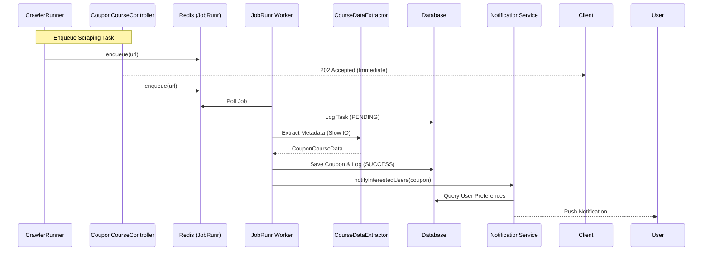

# Business Logic & Flow - Course Deal Server

## Module Map
- **`coupon-common`**: Cross-cutting utilities (logging helper, shared exceptions) used by nearly every other module. No framework-specific infra deps of its own beyond what those utilities need.
- **`coupon-domain`**: Pure data layer. Contains DTOs, JPA entities, repositories, and Flyway migrations. No infrastructure or logic dependencies.
- **`coupon-infrastructure`**: Redis caching/config only (`RedisConfig`, `RedisService`, `LastFetchTimeManager`).
- **`notification-service`**: Firebase Admin SDK (FCM) push notifications (`FirebaseConfig`, `NotificationService`).
- **`course-scraper`**: Specialized domain-specific I/O shared by both deployables. Contains the `CourseScraperService` (JobRunr-backed validation pipeline) and `CourseDataExtractor`.
- **`course-external-api`**: Client for Udemy's public course API (`ExternalCourseApiClient`), used only by `coupon-api-service`.
- **`identity-service`**: Dedicated module for Identity and Access Management (IAM). Handles Social Auth, Passkey handshakes, and User Preferences.
- **`coupon-api-service`**: Business REST stack. Focused purely on course searching, filtering, and detail retrieval.
- **`coupon-crawler-service`**: Background discovery workers that periodically find new course deals and hand them off to `course-scraper` via JobRunr.

## High-Level Architecture
- **Discovery Layer** (`coupon-crawler-service`): Periodically pulls URLs from multiple sources. It does not validate URLs itself; it enqueues them into **JobRunr**.
- **Background Processing** (`CourseScraperService`): A persistent background pipeline powered by **JobRunr** that validates coupons. It handles Udemy API interaction and persists results with full audit logging and automatic retries.
- **Modern Auth** (`SocialAuthController`, `PasskeyAuthController`): Secure, password-less authentication supporting Google, Apple, and Biometric Passkeys.
- **Personalized Notifications** (`NotificationService`): Matches newly discovered coupons against user-defined keywords/categories and sends targeted FCM push notifications.

## Coupon Discovery & Validation Pipeline
1. **Discovery:** `CrawlerRunner` fires every 15 minutes.
2. **Collection:** `EnextCrawler` and `RealDiscountCrawler` collect raw URLs.
3. **Queue Handoff:** Discovered URLs are passed to `CourseScraperService.enqueueScrapingTask()`.
4. **Validation (Background Worker):**
   - JobRunr picks up the task from Redis.
   - `CourseDataExtractor` uses Jsoup to pull course metadata.
   - The result is audited in the `scraping_task_logs` table.
   - If a provider is down, JobRunr automatically retries with exponential backoff.
5. **Persistence & Alerts:**
   - Valid coupons are saved to `CouponCourseRepository`.
   - `NotificationService` checks user preferences and sends targeted FCM pushes.

## Authentication System
- **Social Login:** Validates Google/Apple ID tokens and issues a server-side JWT.
- **Passkeys (WebAuthn):** Two-step biometric handshake (Registration & Authentication) using FIDO2 standards.
- **Security:** `TokenAuthenticationFilter` verifies JWTs and manages the security context for personalized requests (like Preference updates).

## Sequence Diagram (JobRunr Flow)

```mermaid
sequenceDiagram
    participant Crawler as CrawlerRunner
    participant API as CouponCourseController
    participant Redis as Redis (JobRunr)
    participant Scraper as JobRunr Worker
    participant Extractor as CourseDataExtractor
    participant DB as Database
    participant FCM as NotificationService

    Note over Crawler, API: Enqueue Scraping Task
    Crawler->>Redis: enqueue(url)
    API-->>Client: 202 Accepted (Immediate)
    API->>Redis: enqueue(url)
    
    Scraper->>Redis: Poll Job
    Scraper->>DB: Log Task (PENDING)
    Scraper->>Extractor: Extract Metadata (Slow IO)
    Extractor-->>Scraper: CouponCourseData
    Scraper->>DB: Save Coupon & Log (SUCCESS)
    
    Scraper->>FCM: notifyInterestedUsers(coupon)
    FCM->>DB: Query User Preferences
    FCM-->>User: Push Notification
```

## Implementation Touchpoints
- `com.thanh0x.coursedeal.crawler_runner.CrawlerRunner` (in `crawler-service`) – URL discovery loop.
- `com.thanh0x.coursedeal.service.CourseScraperService` (in `course-scraper`) – Core background scraping logic.
- `com.thanh0x.coursedeal.controller.CouponCourseController` (in `api-service`) – REST API for coupons.
- `com.thanh0x.coursedeal.controller.SocialAuthController` (in `identity-service`) – OAuth2 token exchange.
- `com.thanh0x.coursedeal.controller.PasskeyAuthController` (in `identity-service`) – WebAuthn biometric flow.

Use this document to understand the decoupled nature of the "Discovery" and "Processing" layers of the platform.
