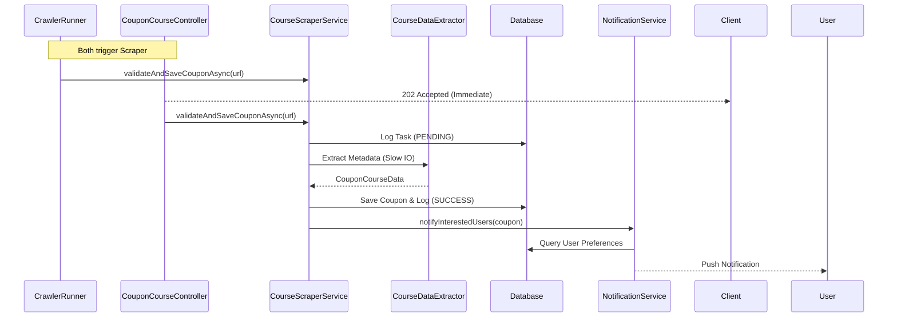

# Business Logic & Flow - Course Deal Server

## Module Map
- **`coupon-domain`**: Pure data layer. Contains DTOs, JPA entities, repositories, and Flyway migrations. No infrastructure or logic dependencies.
- **`coupon-infrastructure`**: Shared technical services. Handles Redis configuration, external API clients (`ExternalCourseApiClient`), and the core scraping engine (`CourseDataExtractor`, `CourseScraperService`).
- **`coupon-api-service`**: REST stack for mobile clients. Handles modern authentication (Social/Passkeys) and search/filter logic.
- **`coupon-crawler-service`**: Background workers that periodically discover new course deals from aggregator sites and hand them off for validation.

## High-Level Architecture
- **Discovery Layer** (`coupon-crawler-service`): Periodically pulls URLs from multiple sources. It does not validate URLs itself; it delegates to the async scraper.
- **Asynchronous Processing** (`CourseScraperService`): A shared pipeline that validates coupons in background threads. It handles Udemy API interaction and persists results with full audit logging.
- **Modern Auth** (`SocialAuthController`, `PasskeyAuthController`): Secure, password-less authentication supporting Google, Apple, and Biometric Passkeys.
- **Personalized Notifications** (`NotificationService`): Matches newly discovered coupons against user-defined keywords/categories and sends targeted FCM push notifications.

## Coupon Discovery & Validation Pipeline
1. **Discovery:** `CrawlerRunner` fires every 15 minutes.
2. **Collection:** `EnextCrawler` and `RealDiscountCrawler` collect raw URLs.
3. **Async Handoff:** Discovered URLs are passed to `CourseScraperService.validateAndSaveCouponAsync()`.
4. **Validation (Background):**
   - A thread from the `scraperExecutor` pool is assigned.
   - `CourseDataExtractor` uses Jsoup to pull course metadata.
   - The result is audited in the `scraping_task_logs` table.
5. **Persistence & Alerts:**
   - Valid coupons are saved to `CouponCourseRepository`.
   - `NotificationService` checks user preferences and sends targeted FCM pushes.

## Authentication System
- **Social Login:** Validates Google/Apple ID tokens and issues a server-side JWT.
- **Passkeys (WebAuthn):** Two-step biometric handshake (Registration & Authentication) using FIDO2 standards.
- **Security:** `TokenAuthenticationFilter` verifies JWTs and manages the security context for personalized requests (like Preference updates).

## Sequence Diagram (Async Flow)

```mermaid
sequenceDiagram
    participant Crawler as CrawlerRunner
    participant API as CouponCourseController
    participant Scraper as CourseScraperService
    participant Extractor as CourseDataExtractor
    participant DB as Database
    participant FCM as NotificationService

    Note over Crawler, API: Both trigger Scraper
    Crawler->>Scraper: validateAndSaveCouponAsync(url)
    API-->>Client: 202 Accepted (Immediate)
    API->>Scraper: validateAndSaveCouponAsync(url)
    
    Scraper->>DB: Log Task (PENDING)
    Scraper->>Extractor: Extract Metadata (Slow IO)
    Extractor-->>Scraper: CouponCourseData
    Scraper->>DB: Save Coupon & Log (SUCCESS)
    
    Scraper->>FCM: notifyInterestedUsers(coupon)
    FCM->>DB: Query User Preferences
    FCM-->>User: Push Notification
```

## Implementation Touchpoints
- `com.thanh0x.coursedeal.crawler_runner.CrawlerRunner` – URL discovery loop.
- `com.thanh0x.coursedeal.service.CourseScraperService` – Core async scraping logic.
- `com.thanh0x.coursedeal.controller.CouponCourseController` – REST API for coupons.
- `com.thanh0x.coursedeal.controller.SocialAuthController` – OAuth2 token exchange.
- `com.thanh0x.coursedeal.controller.PasskeyAuthController` – WebAuthn biometric flow.

Use this document to understand the decoupled nature of the "Discovery" and "Processing" layers of the platform.
