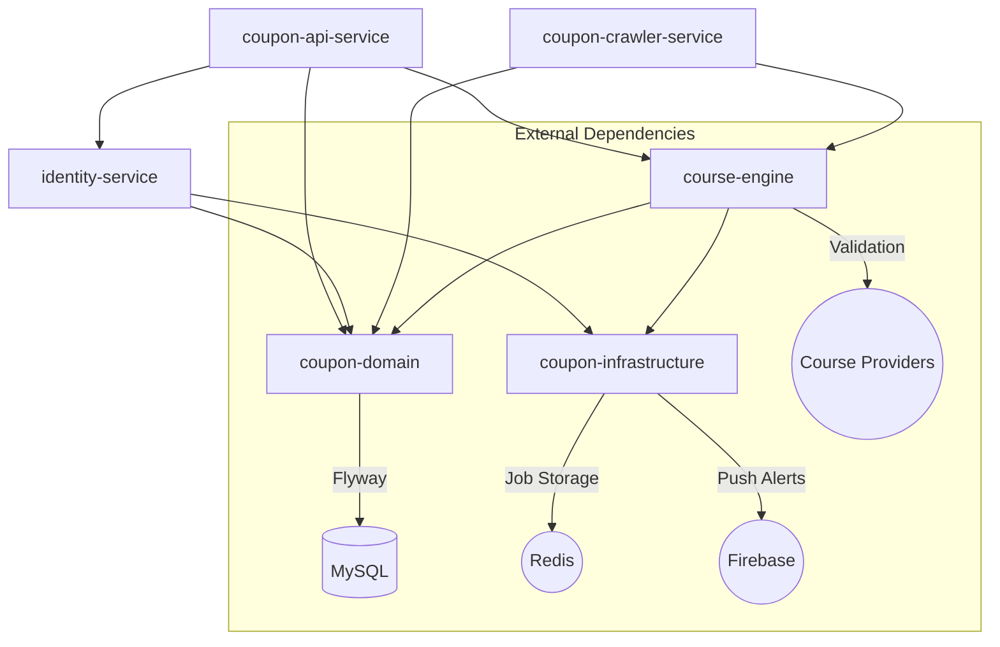

# Getting Started

## Overview
`Course Deal Server` is a modern, asynchronous multi-module backend designed for high performance and security.



### Module Breakdown:
- **`modules/coupon-domain`**: Pure data layer. Entities are mapped to MySQL via JPA.
- **`modules/coupon-infrastructure`**: Generic technical backbone (Redis, FCM).
- **`modules/course-engine`**: Specialized course processing engine (Scraper, External APIs).
- **`modules/identity-service`**: Standalone authentication (Social/Passkey) and user preferences.
- **`modules/coupon-api-service`**: Main REST entry point for course searching and details.
- **`modules/coupon-crawler-service`**: Periodic discovery workers and background job worker.

## Prerequisites
- Java 17 JDK in your `$PATH`.
- Docker Desktop (or compatible) for MySQL and Redis.
- Ports `3306` (MySQL), `6379` (Redis), `8080` (API), and `8081` (Crawler) should be available.

## Bootstrap the Project
```bash
git clone https://github.com/huythanh0x/course-deal-server
cd course-deal-server
```

### Option A: Production Stack via Docker
```bash
docker compose -f docker-compose.prod.yml up
```
Starts the entire backend using pre-built images. Requires a `.env` file with production secrets.

### Option B: Local Development
1. Start data containers:
```bash
docker compose -f docker-compose.local.yml up -d
```
2. Run services from source:
```bash
./gradlew :modules:coupon-api-service:bootRun --args='--spring.profiles.active=local'
# In a separate terminal
./gradlew :modules:coupon-crawler-service:bootRun --args='--spring.profiles.active=local'
```

## Configuration (YAML)
We use hierarchical YAML files for easier management of complex settings.

| File | Purpose | Key Knobs |
| ------------ | ------- | ---------- |
| `application.yml` | Base Config | `spring.datasource`, `org.jobrunr` |
| `application-local.yml` | Dev Environment | `custom.async.scraper.max-pool-size=10`, `jwt-secret`, `logging.level.org.springframework.web=DEBUG` |

### Modern Auth Setup
To enable the full feature set, define these in your environment:
- `GOOGLE_CLIENT_ID`: For social login validation.
- `FIREBASE_CONFIG_PATH`: Path to `service-account.json` for FCM notifications.
- `WEBAUTHN_RP_ID`: Your domain for Passkey support (e.g., `localhost`).

## Useful Gradle Tasks
- `./gradlew build` – clean build and compile all 6 modules.
- `./gradlew test` – runs the test suite (includes **SSRF Hardening**, **Auth**, **SecurityConfig**, and background-job tests).
- `./gradlew ktlintCheck detekt` – lint and static analysis (see [Code Quality](../README.md#code-quality) in the main README).
- `./gradlew flywayMigrate` – manually trigger database schema updates.

## API & Debugging
- **Swagger UI:** [http://localhost:8080/swagger-ui/index.html](http://localhost:8080/swagger-ui/index.html)
- **OpenAPI JSON:** `/v3/api-docs`
- **Audit Logs:** Check the `scraping_task_logs` table in the database to debug asynchronous background scraping tasks.

## Troubleshooting
- **SSRF Blocked:** If you see "SSRF Blocked" in logs, the URL you submitted resolves to a private IP or is not in the `ALLOWED_DOMAINS` list in `UrlValidator`.
- **Handshake Expired:** Passkey/WebAuthn challenges expire after 5 minutes in Redis.

## Contributing
- Follow `CONTRIBUTING.md`.
- Ensure all tests pass (`./gradlew test`) before committing new logic.

You're ready to build! Spin up Docker, run the API, and start discovering deals.
